<h2>Compte rendu</h2>
<h2>Partie Code/h2>
<h2>Architecture du projet</h2>
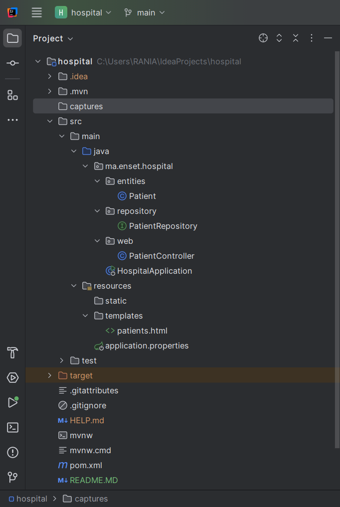
<h2>class Patient</h2>
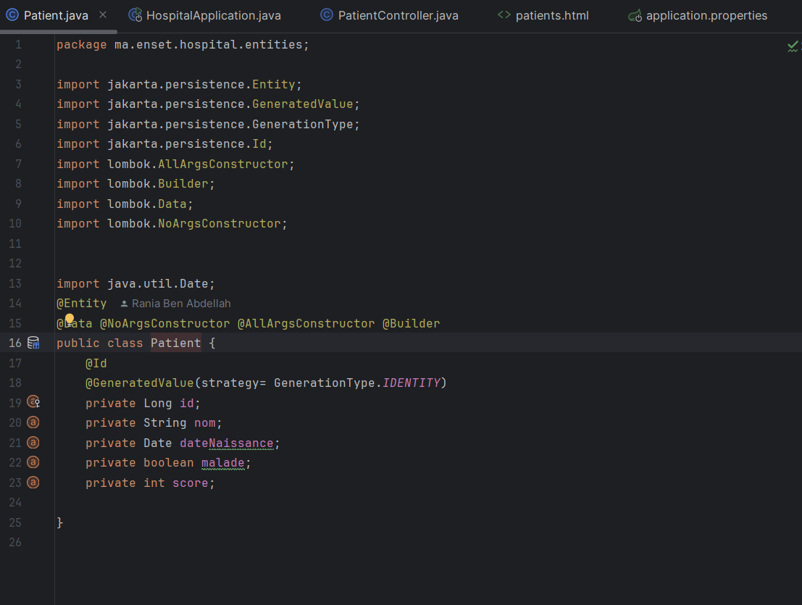
<h2>class Interface PatientRepository</h2>
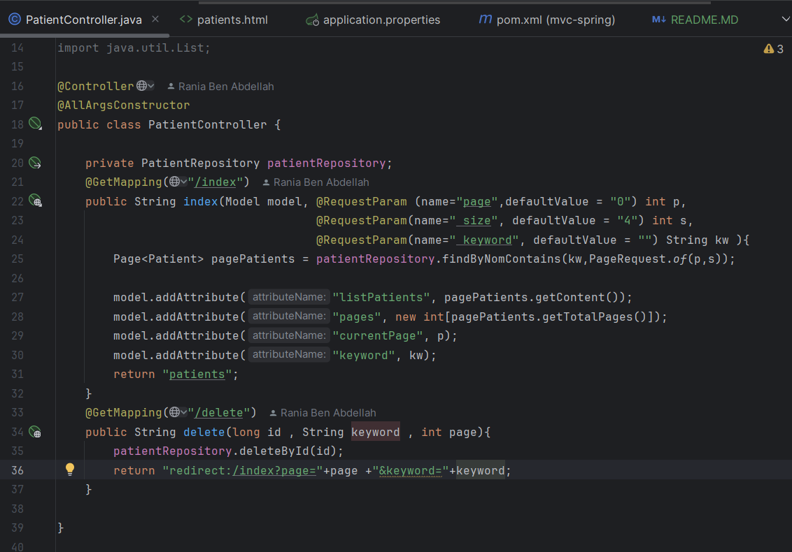
<h2>class PatientController</h2>

<h2>class HospitalApplication</h2>
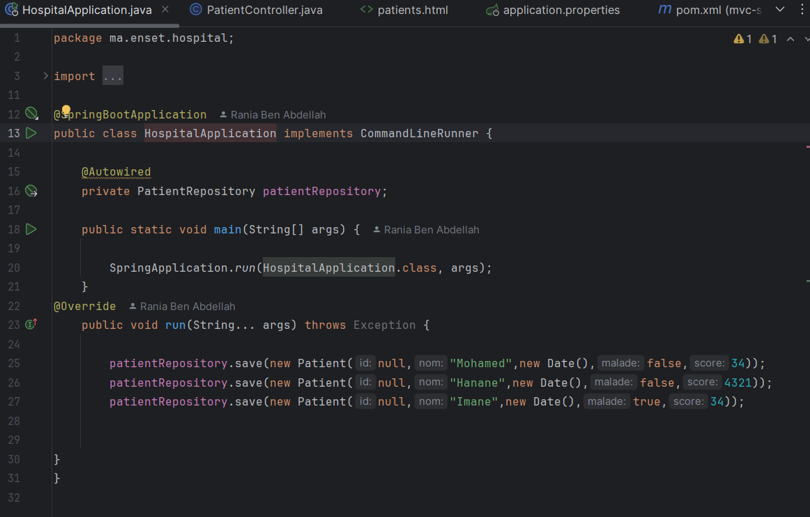
<h2> patients.html</h2>
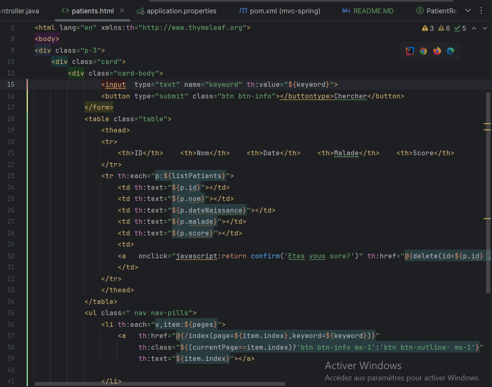
<h2> appliaction.properties</h2>
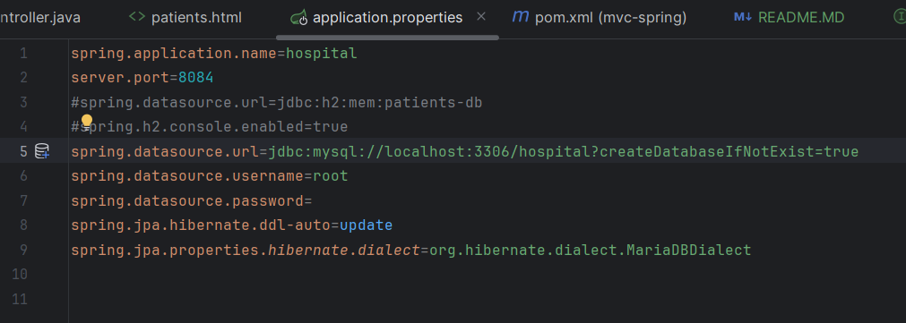
<h2> Partie Base De Donnée</h2>
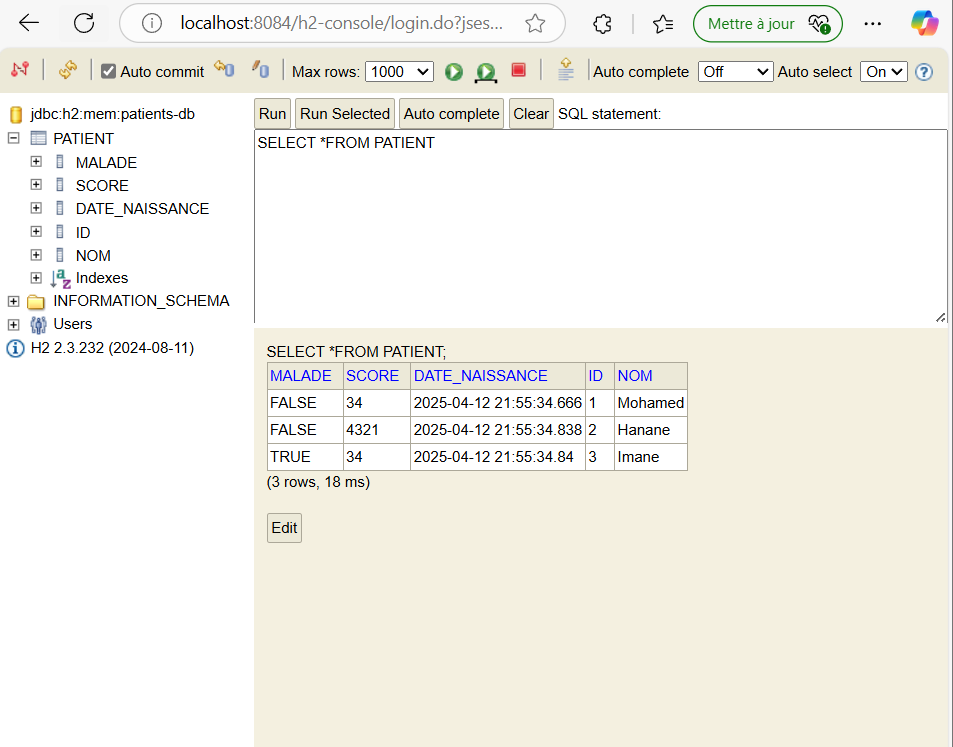
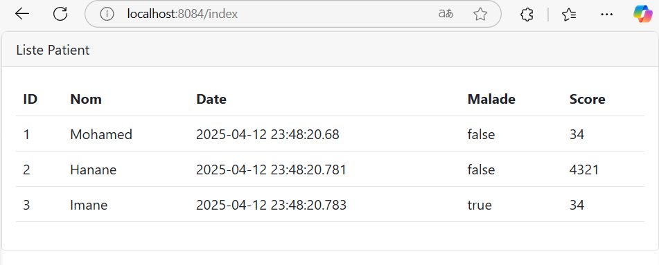
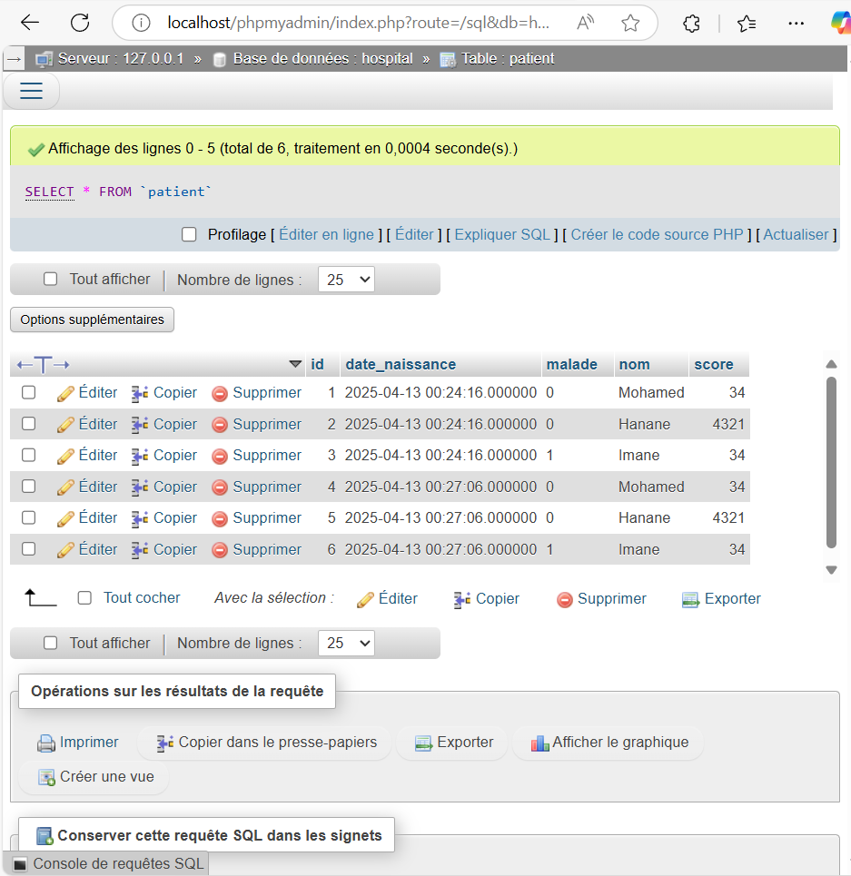
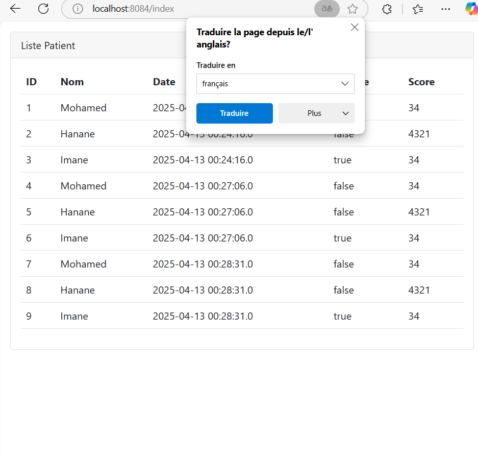
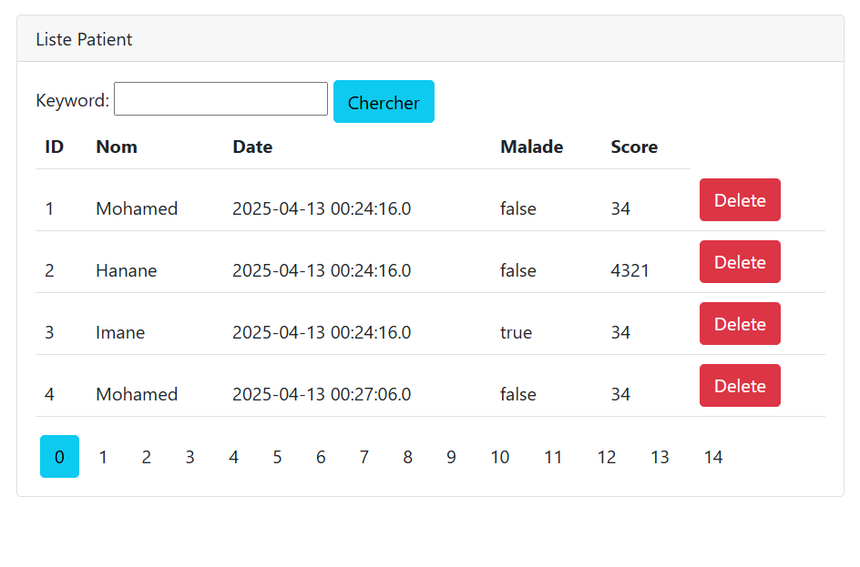
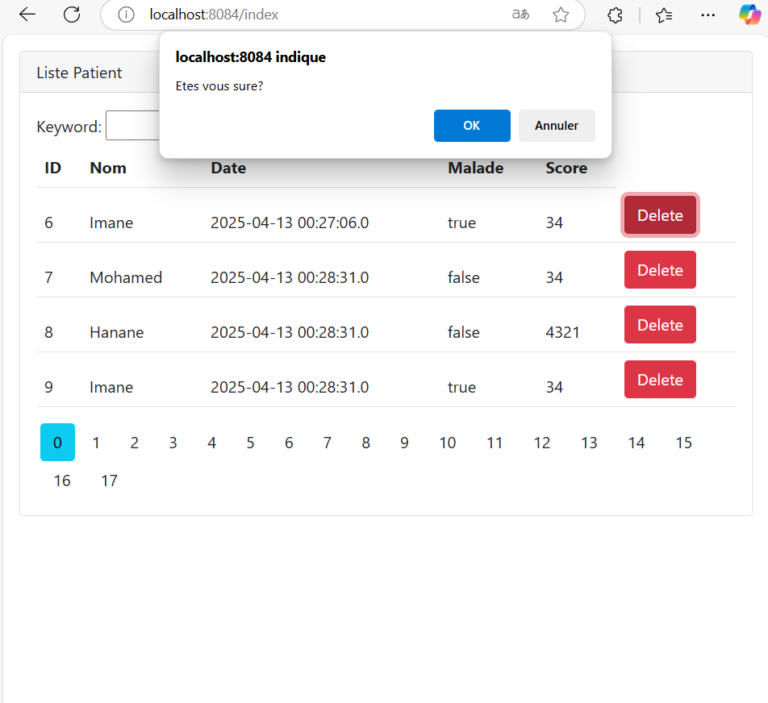

